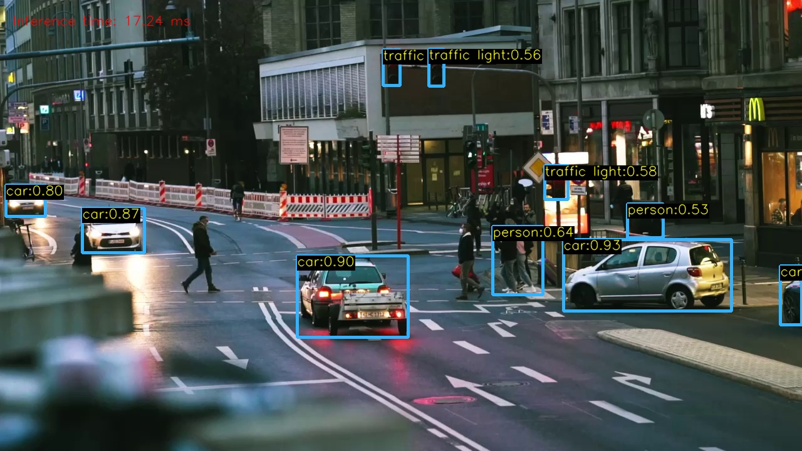
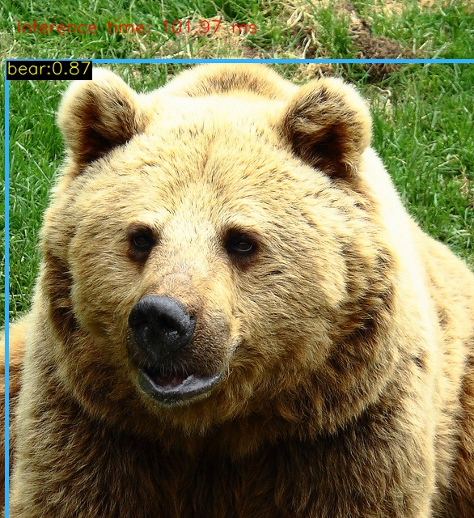
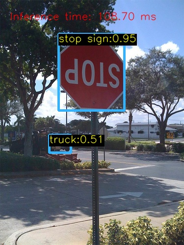
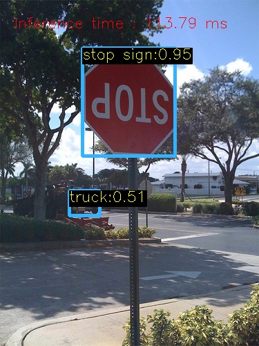
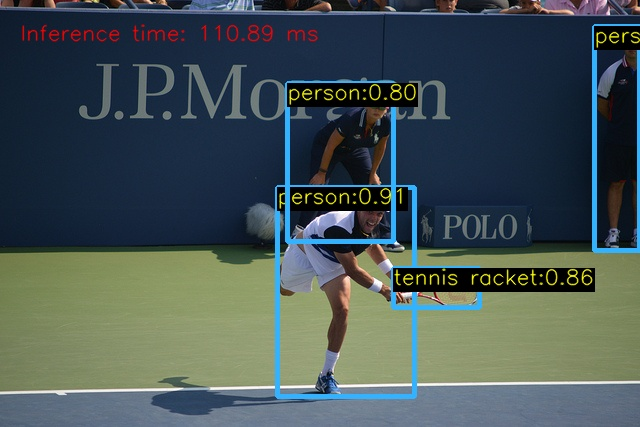
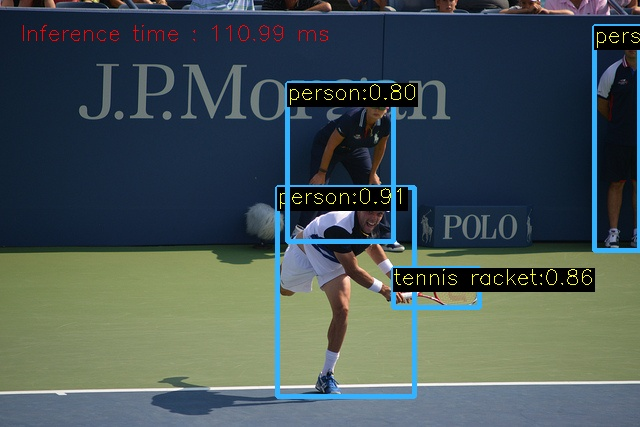

# Medtronic Tech Challenge finished by Bo-Chen

## Introduction

This project offers a comprehensible and comprehensive C++& python implementation of YOLOv5 using OpenCV DNN for COCO dataset, based the original code in [spmallick's learnopencv repository.](https://github.com/spmallick/learnopencv/tree/master/Object-Detection-using-YOLOv5-and-OpenCV-DNN-in-CPP-and-Python)

**Main Contributions:**

- **Issue Resolution**: Addressed [#issue 691 no detection results](https://github.com/spmallick/learnopencv/issues/691). The issue was due to the absence of an error message when `ifstream ifs("coco.names")` failed to find the file. The solution is to adjust the file path to `"../coco.names"` when using CMake in the `build` directory.
- **Enhanced Code Maintainability**: Implemented Explicit Namespace Usage in C++ (e.g., using cv:: prefixes), facilitating better long-term maintenance and readability. And also seperate the bounding box drawing part with NMS part in the C++ code.
- **Preprocessing Improvements**: Incorporated 'letterbox preprocessing' in both C++ and Python code to preserve the aspect ratio in resizing input image, enhancing the quality of the output.
- **Performance Boost with CUDA**: Integrated CUDA-enabled ONNX Runtime inference into the Python code, significantly speeding up the processing. And also enable OpenCV DNN could use cuda.
- **Batch Processing Feature**: Added a function to process the first specified number of images in a folder, applicable to both C++ and Python code.
- **Evaluation Function Enhancement**: Integrated the evaluation function (average precision and recall) for Python code. This update resolves the inconsistency between the original network output classes (1-80) and COCO's annotation dataset (1-91). Additionally, it enables the evaluation of any specified number of images in the COCO dataset, as evaluating full dataset takes around 15 mins in a CPU-manner.


## Table of contents[](#table-of-contents)

- [Code Structure](#code-structure)
- [Execution](#execution)
- [Sample](#sample)
- [Evaluation](#evaluation)
- [Environment](#environment)


## Code Structure

```
YOLOv5-Inference-Python&CPP 
│
├── coco/               ⭐ input,middle_file,output for COCO's evaluation
│   ├── coco_output_cpp/                
│   ├── coco_output_py/
│   ├── val2017/                        # 5000 pictures for evaluation
│   ├── cocoval17_predictions.json
│   ├── instances_val2017.json          # Ground truth Annotation for val2017
│   ├── instances_val2017.json_filtered # Ground truth for first XX images
│   ├── classes.txt						# COCO: 80 classes names
│   └── ...
├── weights/  #         ⭐ Models' weight and onnx           
│   ├── yolov5(?).pt 					# Pytorch trained model
│   ├── yolov5(?).onnx                  # Onnx model, (?) is model size 
│   └── ...
│
├── yolov5_1_refactor/  ⭐ C++,Refactor
│   └── src/
│   	└──yolov5_refactor.cpp          
│   	└──yolov5_original.cpp          # fixed its running bugs
│
├── yolov5_2_letterbox/ ⭐ C++,Resize with Aspect Ratio Preserved
│   └── src/
│   	└──yolov5_letterbox.cpp
│ 
├── yolov5_3_batch/     ⭐ C++,batch processing for COCO's first XX images
│   └── src/
│   	└──yolov5_batch.cpp
│
├── output_XX.jpg       ⭐ Output results for different methods
│
├── yolov5.py               ⭐ Original Python file
│
├── yolov5_onnxruntime.py   ⭐ Accelerate by onnxruntime-gpu 
│
├── yolov5_letterbox.py     ⭐ Resize with Aspect Ratio Preserved
│
├── yolov5_evaluate.py   	⭐⭐ AP&AR: variant models and dataset size
│
└── README.md

```


## Execution

#### Python

yolov5.py

```
python yolov5.py 
```

yolov5_onnxruntime.py
```
# If want to use GPU acceleration, need, pip uninstall onnexruntime
# And also, pip install onnxruntime-gpu==1.16.3
pip install onnxruntime-gpu==1.16.3
```

yolov5_letterbox.py

```
python yolov5_letterbox.py
```

python yolov5_evaluate.py ( it can download COCO eval dataset, batch process and evaluate)

```
python yolov5_evaluate.py
# it have five default parameter
# python yolov5_evaluate.py --input_images_folder "coco/val2017" --output_images_folder "coco/coco_output_py" --model_weights "weights/yolov5n.onnx" --coco_anno "coco/instances_val2017.json" --image_size 20
# If want to eval the full dataset 
python yolov5_evaluate.py --image_size 5000
```

#### C++ Linux

cmake

```
mkdir build # if do not have build directory
cd build
cmake ../src
cmake --build .
```

run for yolov5_1_refactor and yolov5_2_letterbox

```
# run opencv in CPU
./main
# run opencv in GPU (but need compile opencv with GPU, need several hours)
./main cuda
```

run for yolov5_3_batch

```
./main no_cuda 20
# first argument is whether use opencv with GPU, second argument is the number of processed picture
```

## Sample

<table align="center">
  <tr>
    <td align="center">yolov5.py</td>
    <td align="center">yolov5_refactor.cpp</td>
  </tr>
</table>
<!-- Second Row with Images --> <p align="center">
  
  
</p>

<table align="center">
  <tr>
    <td align="center">yolov5.py</td>
    <td align="center">yolov5_onnxruntime.py</td>
  </tr>
</table>
<!-- Second Row with Images --> <p align="center">  </p>
> Inference time: 107ms vs 17ms

<table align="center">
  <tr>
    <td align="center">yolov5.py</td>
    <td align="center">yolov5_letterbox.py</td>
  </tr>
</table>
<!-- Second Row with Images --> <p align="center">   </p>
> Adding letterbox preprocessing could improve the detection result (more people are detetced)


## Evaluation

### Python and C++ implementation equivalence
Python command to process first 20 pictures (automatically download and unzip val2017/): `python yolov5_evaluate.py --image_size 20`  
C++ command to process first 20 pictures: `./main no_cuda 20`
<table align="center">
  <tr>
    <td align="center">./coco/coco_output_py</td>
    <td align="center">./coco/coco_output_cpp</td>
  </tr>
</table>

<div>
   
  
</div>
<div>
   
  
</div>
<div>
   
  
</div>


### Average precision, average recall and time for different models
If we use n size model for full dataset (5000 images) with command `python yolov5_evaluate.py --model_weights "weights/yolov5m.onnx" --image_size 5000` 


> mAP is 0.35, MAR is 0.40, average inference time is 196ms, but full running time is 20 mins without cuda-enabled! Considering this, my code could filtered the ground truth file, and evaluate for small dataset (first xx).

`python yolov5_evaluate.py --model_weights "weights/yolov5n.onnx" --image_size 20`  
`python yolov5_evaluate.py --model_weights "weights/yolov5s.onnx" --image_size 20`  
`python yolov5_evaluate.py --model_weights "weights/yolov5m.onnx" --image_size 20`  


## Environment

## Method 1
#### Build local docker and compile opencv (1h), core steps are step 4 & step 5
>- Step1: download docker follow the guidance https://docs.docker.com/engine/install/ubuntu/ 
>
>```
>docker run hello-world  #test
>systemctl restart docker #restart
># if have to run docker with sudo, and daemon is at unix:///home/XXX rather than unix:///var/xxx, need rm -rf .docker/
>```
>
>- Step2: Add GPG key and Nvidia repository, follow the guidance https://docs.nvidia.com/datacenter/cloud-native/container-toolkit/latest/install-guide.html
>
>And install nvidia-container-toolkit
>
>```
>sudo apt-get update
>sudo apt-get install -y nvidia-container-toolkit
>```
>
>- Step3: Pull an image (nvcr.io/nvidia/pytorch:22.03-py3) to create container named env_pyt, from Nvidia website https://catalog.ngc.nvidia.com/containers. 
>
>```
>docker run --gpus all -it --name env_pyt -v $(pwd):/app nvcr.io/nvidia/pytorch:22.03-py3
>```
>
>- Step4: Install opencv 4.5.5 and opencv_contrib 4.5.5
>
>```
># prerequisities
>apt update && apt install -y cmake g++ wget unzip
># download and unpack sources
>wget -O opencv.zip https://github.com/opencv/opencv/archive/4.5.5.zip
>wget -O opencv_contrib.zip https://github.com/opencv/opencv_contrib/archive/4.5.5.zip
>unzip opencv.zip
>unzip opencv_contrib.zip
># configure
>mkdir -p build && cd build
>cmake -DOPENCV_EXTRA_MODULES_PATH=../opencv_contrib-4.5.5/modules ../opencv-4.5.5
>cmake --build .
>make install
>```
>
>- Step 5: install this repo, and some libraries for python.
>```
>git clone https://github.com/BCYounker/YOLOv5_inference_python_cpp.git
>apt install -y libgl1-mesa-glx
>pip install -r requirements.txt
>install opencv-python==4.5.5.64
>```

